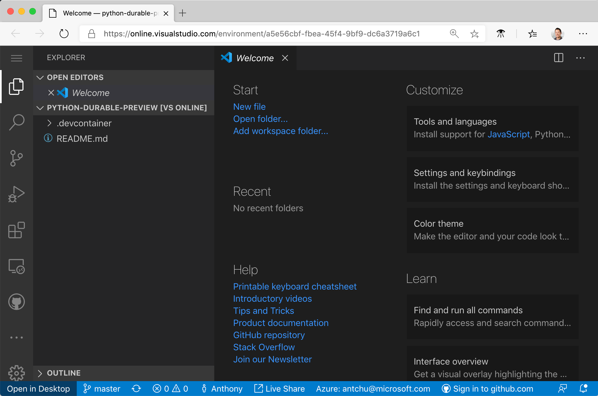
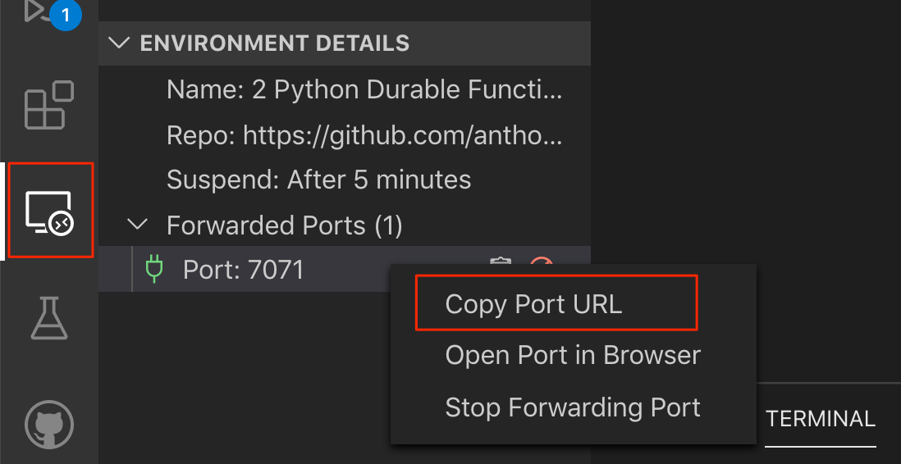

# Python Durable Functions Preview 🐍🌩

Follow this guide to get up and running with Python Durable Functions!

> **Note:** (2020-03-13) Because updated versions of the Azure Functions Python worker, extension bundles, and templates that are needed for the preview have not yet been published or deployed to Azure, you need to use a dev container with Visual Studio Code Remote for Containers or Visual Studio Online.
>
> You'll be able to deploy to Azure in April.

## Prerequisites

* Azure subscription - Durable Functions requires a storage account. The easiest way to get started is by connecting to a storage account in Azure.
* An editor that supports Visual Studio dev containers
    - Visual Studio Code
        - Docker - the local machine must be able to run Linux Docker containers
        - [Remote Development extension pack](https://marketplace.visualstudio.com/items?itemName=ms-vscode-remote.vscode-remote-extensionpack) - starts and connects to the dev container
    - Visual Studio Online
        - VS Online provides a development environment in the cloud that you can connect to using VS Code or VS Online's full-featured, browser-based code editor. 

## Instructions

### Start the development environment

Choose one of the following options and follow the instructions to create a development environment.

#### Option 1 - Visual Studio Code with Remote Development extension and Docker

1. Clone this repo to your computer.
1. Open the repo's folder in VS Code.
1. Using the Command Palette (press `F1` or `Ctrl-Shift-P` or `Cmd-Shift-P` (macOS)), search for and run the *Reopen in Container* command. VS Code will reopen, start the development environment in Docker, and connect to it.

#### Option 2 - Visual Studio Online

1. In a new browser window, open this magical link: [Open in Visual Studio Online](https://online.visualstudio.com/environments/new?name=Python+Durable+Functions+Preview&repo=https://github.com/anthonychu/python-durable-preview)
1. If prompted, sign in.
1. A Create Environment dialog appears. Confirm the information and click *Create*. Wait a few minutes to create the environment.
1. Click *Connect* to open the VS Online in-browser code editor.

    

### Create the Azure Functions project

The preconfigured development environment includes the Azure Functions Core Tools CLI (`func`) with the preview Python lanugage worker, useful VS Code extensions, as well as templates to help you get started.

1. In the editor, you should have the default workspace folder opened.
1. Press `F1` or `Ctrl-Shift-P` or `Cmd-Shift-P` (macOS) to open the Command Palette
1. Search for and run the *Azure Functions: Create New Project...* command.
    > If you are using VS Online, the extensions may not load immediately the first time. If you don't see any Azure Functions commands, try reloading your browser.

    

1. Select the following responses when prompted:

    | Prompt | Value | Description |
    | --- | --- | --- |
    | Specify a folder | Current open workspace folder | |
    | Select a language | Python | |
    | Python version | Python 3.7 | Azure Functions supports Python 3.6-3.8 above |
    | Select a template | Skip for now | |

### Activate virtual environment and install dependencies

When you created the project, the Azure Functions VS Code extension automatically created a virtual environment with your selected Python version. You will activate the virtual environment in a terminal and install some dependencies required by Azure Functions and Durable Functions.

1. Open the editor's integrated terminal in the current folder (`` Ctrl-Shift-` ``).
1. In the integrated terminal, activate the virtual environment in the current folder:

    ```bash
    source .venv/bin/activate
    ```

    

1. Open `requirements.txt` in the editor change its content to the following:

    ```
    azure-functions>=1.2.0
    azure-functions-durable>=1.0.0b2
    ```

    Durable Functions requires `azure-functions` version 1.2.0 or greater.

1. In the integrated terminal where the virtual environment is activated, use pip to install the packages we just defined:

    ```bash
    python -m pip install -r requirements.txt
    ```

Use this integrated terminal with the activated virtual environment for the rest of this tutorial.

### Create the functions

The most basic Durable Functions app contains three functions:
- *Orchestrator function* - describes a workflow that orchestrates other functions
- *Activity function* - called by the orchestrator function, performs work, and optionally returns a value
- *Client function* - a regular Azure Function that starts an orchestrator function

> *Note:* The templates for creating Durable Functions are currently only available using the Azure Functions Core Tools CLI inside this dev container environment. In the future, you'll be able to create Durable Functions using the Azure Functions VS Code extensions as well.

#### Orchestrator function

1. In the integrated terminal, create a durable orchestration function:
    1. Run `func new`.
    1. Select *Durable Functions orchestrator*.
    1. Use the default name of *DurableFunctionsOrchestrator*.

    

This creates a function in a folder named *DurableFunctionsOrchestrator*. In the folder, you'll find a `function.json` file that contains metadata describing the function.

You'll also find the function in `__init__.py`. An orchestrator is a Python generator function that describes how activity functions are called.

#### Activity function

1. In the integrated terminal:
    1. Run `func new`.
    1. Select *Durable Functions activity*.
    1. Use the default name of *Hello*.

This creates a function in a folder named *Hello*. In the folder, you'll find a function that simply returns a greeting. An activity function is a normal Azure Function; it is where you'll do actual work such as accessing databases and perform calculations.

#### HTTP triggered client function

1. In the integrated terminal:
    1. Run `func new`.
    1. Select *Durable Functions HTTP starter*.
    1. Use the default name of *DurableFunctionsHttpStart*.

This creates a function in a folder named *Hello*. In the folder, you'll find a typical HTTP triggered Azure Function that also takes an orchestration client input binding. The function uses the orchestration client to start an orchestration and return an HTTP response containing URLs the caller can use to check the orchestration's status.

### Run the app

1. Press `F5` or select *Debug: Start Debugging* from the Command Palette. The function app will start and the debugger will attach.
1. Because no storage account was set in `local.settings.json`, the Azure Functions VS Code extension should prompt you to select a storage account. Sign in to Azure and create a new storage account. You may also select an existing storage account that you have *not* used with Durable Functions.
    

1. Once the app is started, click on the *Remote Explorer* icon in the VS Code activity bar.
1. Under *Environment Details*, port *7071* should already be listed as forwarded. Right-click on it and select *Copy Port URL*.
    

1. Open another browser window and paste in the copied port URL. A default Function App page should display.
    

1. In the location bar, append `/api/orchestrators/DurableFunctionsOrchestrator` to the URL to trigger the *DurableFunctionsHttpStart* function and start an instance of *DurableFunctionsOrchestrator*.
    

1. The HTTP function should return a set of URLs. Open the `statusQueryGetUri` in a browser window to view the orchestrator function's status.
    > In VS Online, localhost URLs may be returned. Replace `http://localhost` with the VS Online port URL.
    

1. Stop debugging by clicking the red *Disconnect* button or press `Shift-F5`.

Congratulations! You've built and ran your first Python Durable Functions app! 🎉

## Next steps

* [Check out Durable Functions docs](https://docs.microsoft.com/en-us/azure/azure-functions/durable/durable-functions-overview?tabs=python) (Python code samples coming soon)
* Send us feedback at our GitHub repo (coming really soon)
* Deploy the app to Azure (coming soon, bits should be deployed to Azure by end of March)
